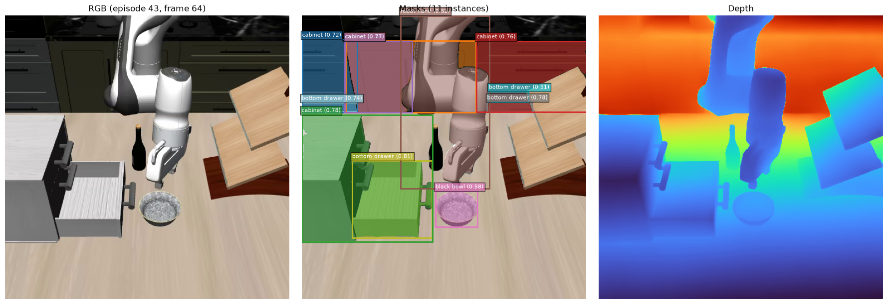

# Robot Manipulation Visual Annotation Pipeline

A config-driven pipeline that adds **instance-segmentation masks** and **metric depth**
to robot manipulation datasets in [**LeRobot v3.0**](https://github.com/huggingface/lerobot)
format, storing the annotations losslessly so they can be reused as training signal for
downstream robot-learning / world-model pre-training.

> Originally built as a collaborator on an internal robot-data annotation effort. This public
> fork is **reproducible on open Hugging Face Hub data** ([`lerobot/svla_so100_sorting`](https://huggingface.co/datasets/lerobot/svla_so100_sorting)) —
> see [`QUICKSTART_PUBLIC.md`](QUICKSTART_PUBLIC.md). Internal dataset paths and model
> codenames have been removed.

Data flow:

```
episode instruction → Object Discovery → SAM3 instance masks
                                       → Depth-Anything-3 metric depth → lossless storage → QC
```

The storage layer is **decoupled from any training representation** — it only preserves raw
annotations keyed by `(episode_idx, frame_idx)`, so any downstream consumer can ingest them.

---

## Four-layer architecture

Decoupled, config-driven, pluggable (code under `annotation/`):

1. **Discovery** — extract object queries from each episode's task instruction, auto-appending
   `robot hand` / `gripper`. Extractors are configurable (`discovery.extractor`):
   `rule` (regex/POS), `manual` (oracle upper-bound), `qwen` (real VLM/LLM extractor),
   `mock` (no-model smoke). Uniform interface `discover_objects(instruction, config) -> list[str]`.
2. **Segmentation** — SAM3 text-prompted segmentation → per-instance mask + bbox + score.
   Vision-encoder output is reused across multiple queries on the same frame for speedup.
3. **Depth** — Depth-Anything-3 monocular **metric** depth, fully independent of segmentation.
4. **Storage** — masks as Parquet (COCO compressed RLE); depth as 16-bit PNG (mm) + JSON metadata.

---

## Subtask-aware sampling

Annotating every frame of a long demo is wasteful (adjacent frames barely change).
`sampling.mode: subtask_aware` groups frames by `subtask_index`, samples at a fixed stride
within each segment, and **force-keeps each segment's first/last (boundary) frame** — the
most informative frames for skill transitions. Falls back to `uniform` for datasets without
subtask labels. Every run writes `sampling_manifest.parquet` mapping each sampled frame back
to its original frame index and subtask, for clean downstream alignment.

---

## Stage decoupling

Segmentation (SAM3) and depth (DA3) can run independently and never load each other's model,
so two annotators can split the work:

```bash
python run_annotate.py configs/<cfg>.yaml --stage segmentation   # SAM3 only
python run_annotate.py configs/<cfg>.yaml --stage depth          # DA3 only
python run_annotate.py configs/<cfg>.yaml --stage both           # default
```

Each stage keeps its own output dir and checkpoint and resumes independently. With the same
`dataset_path` + `episode_indices` + `sampling`, the two stages sample identical frames, so
masks and depth join cleanly by `(episode_idx, frame_idx)`.

---

## Engineering guarantees

- **Config-driven**: all paths/params in YAML, zero hardcoding.
- **Checkpoint resume / idempotent**: already-annotated frames are skipped.
- **Per-frame failure isolation**: one bad frame never crashes the episode/job.
- **Dry-run mode**: runs Discovery only to validate instruction → queries fast.
- **Mock paths**: full pipeline runs end-to-end with no models, for CI/architecture checks.
- **QC visualization**: auto RGB | mask-overlay | depth triptychs.

---

## Quickstart (public data)

See [`QUICKSTART_PUBLIC.md`](QUICKSTART_PUBLIC.md). Short version:

```bash
huggingface-cli download lerobot/svla_so100_sorting --repo-type dataset \
  --local-dir ./data/svla_so100_sorting
python run_dryrun.py configs/lerobot_so100_dryrun.yaml          # no GPU/models needed
python run_annotate.py configs/lerobot_so100_smoke.yaml --stage segmentation  # GPU + SAM3
```

---

## Results (validated on LIBERO, LeRobot v3)

End-to-end SAM3 segmentation run on LIBERO manipulation episodes (`configs/lerobot_libero_smoke.yaml`):
**132 mask instances** across sampled frames, mean confidence **0.70**, with clean object
categories (`stove`, `moka pot`, `cabinet`, `bottom drawer`, `microwave`, `black bowl`,
`yellow and white mug`, `robot hand`). QC triptych (RGB | instance masks | depth):



**Discovery: `rule` vs `qwen` extractor.** A locally self-hosted Qwen (vLLM, OpenAI-compatible
endpoint) removes the rule extractor's dirty long-phrase / fragment queries
(full table: [`docs/rule_vs_qwen.md`](docs/rule_vs_qwen.md)):

| instruction | `rule` (noisy) | `qwen` (clean) |
|---|---|---|
| turn on the stove and put the moka pot on it | `stove and put moka pot on it` | `moka pot`, `stove` |
| put the yellow and white mug in the microwave and close it | `yellow and`, `yellow and white mug in microwave and close it` | `microwave`, `yellow and white mug` |
| put both the alphabet soup and the cream cheese box in the basket | `alphabet soup and cream cheese box in basket`, `box` | `alphabet soup`, `basket`, `cream cheese box` |

Reproduce: `python run_dryrun.py configs/lerobot_libero_qwen.yaml` against a LIBERO LeRobot-v3
dataset (point `dataset_path` at your local copy) with a Qwen endpoint configured.

---

## Key technical note: DA3 metric depth

DA3 must be loaded with `from_pretrained` — constructing `DepthAnything3(model_name=...)`
builds the architecture **without loading the checkpoint**, yielding constant depth. After
loading, `result.depth` is a raw network output, converted to meters via
`metric_depth_m = focal_px * raw / 300`, where `focal_px` is scaled from the camera's
calibration resolution to DA3's actual output resolution (derived from the output shape).
Camera intrinsics are rig-specific and must be supplied via config (`depth.fx/fy/...`);
rig-specific values are intentionally not committed here.

---

## Output formats

- **Masks** — `masks.parquet`: `episode_idx, frame_idx, instance_id, category, score,
  rle_counts, rle_size, area, bbox` (COCO compressed RLE).
- **Depth** — `depth/<camera>/episode_<idx>/frame_<idx>.png` (16-bit mm) + sidecar `.json`
  (`depth_type`, `original_min/max`, metric conversion note).
- **Sampling manifest** — `sampling_manifest.parquet` (sampled frame ↔ original idx ↔ subtask).
- **QC** — `qc/qc_ep<e>_frame<f>.png` (RGB / mask overlay / depth triptych).

---

## Layout

```
annotation/
  config.py                  # dataclass config schema
  lerobot_v3_dataset.py      # LeRobot v3 reader + frame sampling (uniform / subtask_aware)
  discovery/                 # object discovery (rule / manual / qwen / mock)
  segmentation/sam3.py       # SAM3 segmentation
  depth/depth_anything3.py   # DA3 metric depth
  storage/                   # Parquet mask + PNG16 depth writers
  qc/visualize.py            # QC triptychs
pipeline.py                  # orchestration
run_annotate.py / run_dryrun.py
configs/                     # YAML configs
```
